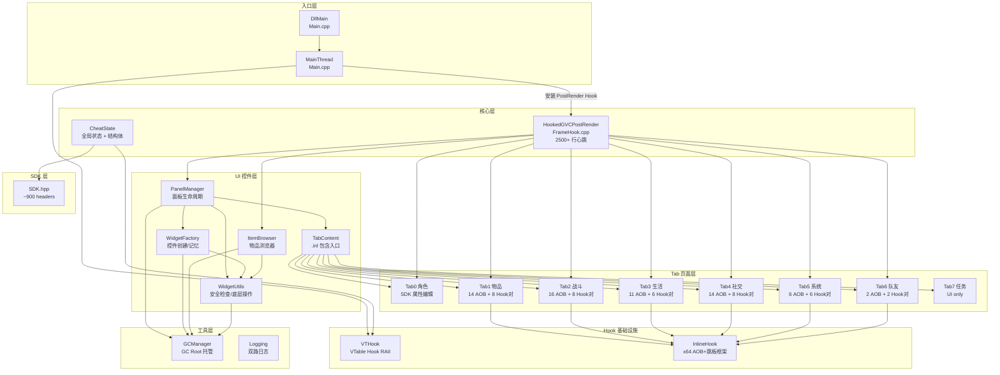
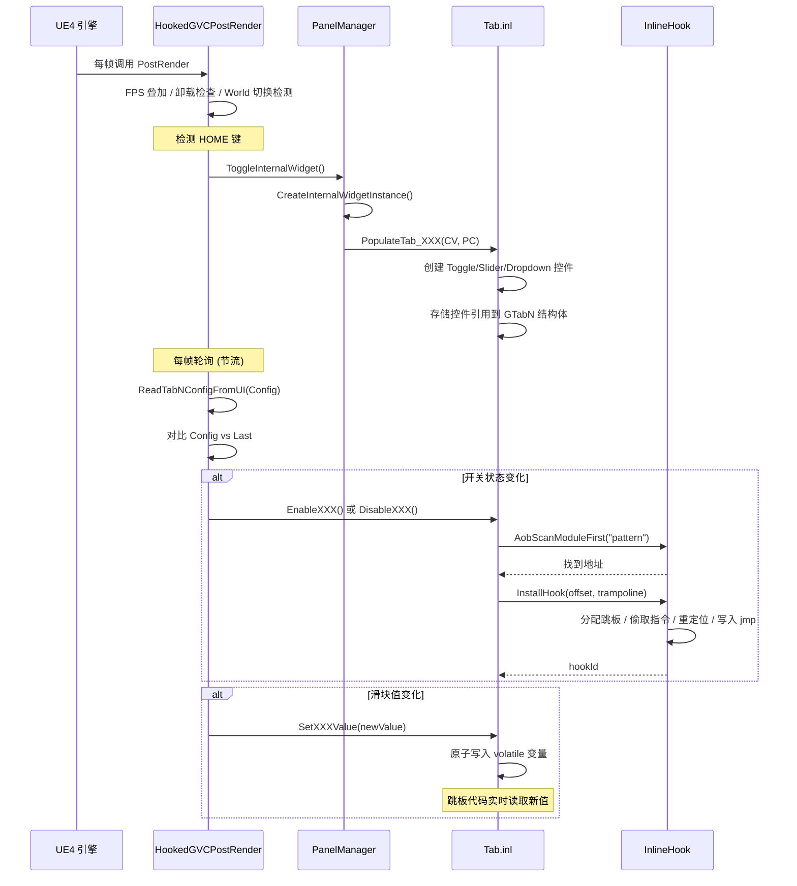
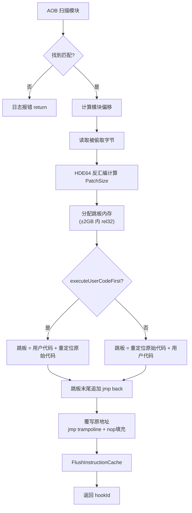
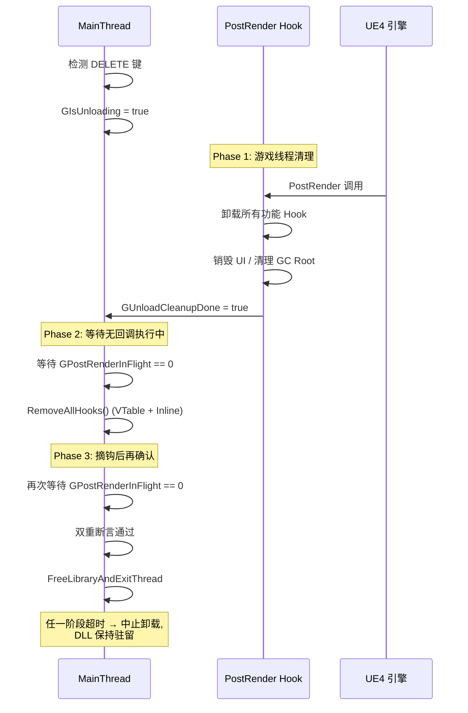

# 逸剑风云决 内置修改器 · 项目地图

> 目标游戏: 逸剑风云决 (Wandering Sword) V1.24.32 — Unreal Engine 4.26.2  
> 技术路线: version.dll 代理劫持 → PostRender VTable Hook → 劫持游戏设置面板作为修改器 UI

---

## 1. 项目总览

```
WanderingSword.Cheat/
├── Proxy/                          # 外壳 DLL (version.dll 代理)
│   └── Main.cpp                    # DLL 劫持入口 (开发阶段验证用)
├── Inject/                         # 核心注入 DLL
│   ├── Core/                       # 核心逻辑层
│   │   ├── Main.cpp                # DLL 入口点 + 三阶段安全卸载
│   │   ├── FrameHook.cpp/hpp       # 帧回调心跳 (2500+ 行)
│   │   └── CheatState.cpp/hpp      # 全局状态声明与定义
│   ├── Widget/                     # UI 控件层
│   │   ├── PanelManager.cpp/hpp    # 面板生命周期管理
│   │   ├── WidgetFactory.cpp/hpp   # 控件工厂 (创建/记忆/恢复)
│   │   ├── WidgetUtils.cpp/hpp     # 安全性检查 + 底层控件操作
│   │   ├── ItemBrowser.cpp/hpp     # 物品浏览器 (DataTable + 网格 + 悬浮提示)
│   │   ├── TabContent.cpp/hpp      # Tab 页面容器 + .inl 包含入口
│   │   └── Tabs/Pages/             # 8 个 Tab 页面实现
│   │       ├── Tab0Character.inl   # 角色属性编辑 (2246 行)
│   │       ├── Tab1Items.inl       # 物品系统 (1424 行)
│   │       ├── Tab2Battle.inl      # 战斗系统 (1512 行)
│   │       ├── Tab3Life.inl        # 生活技能 (657 行)
│   │       ├── Tab4Social.inl      # 社交系统 (518 行)
│   │       ├── Tab5System.inl      # 系统设置 (491 行)
│   │       ├── Tab6Teammates.inl   # 队友管理 (231 行)
│   │       └── Tab7Quests.inl      # 任务系统 (76 行)
│   └── Utility/                    # 通用工具层
│       ├── GCManager.cpp/hpp       # UE4 GC Root 管理
│       └── Logging.cpp/hpp         # 文件 + 控制台双路日志
├── SDK/                            # Dumper-7 生成的 UE4 SDK (gitignored)
├── SDK.hpp                         # SDK 总入口 (~900 个 include)
├── VTHook.hpp                      # VTable Hook 封装 (RAII)
├── InlineHook.hpp/cpp              # x64 Inline Hook 框架 (HDE64 + AOB + 跳板)
├── PropertyFixup.hpp               # SDK 类型修补
└── 进度.md / 轮询点与掉帧分析.md   # 开发笔记
```

---

## 2. 模块依赖关系图



---

## 3. 数据流: 从 HOME 键到功能生效



---

## 4. Tab 页面功能矩阵

### Tab0 角色 (SDK 属性编辑, 无内存补丁)

| 功能 | 实现方式 | 状态 |
|------|----------|------|
| 66 种属性编辑 | `UNPCFuncLib::Get/AddFloatAttribute` | ✅ |
| 角色选择 | `UTeamManager::TeamInfos` 遍历 | ✅ |
| 门派切换 | `UNPCManager::ChangeGuildId` | ✅ |
| 4 种倍率滑块 | 直接写 `FGameplayAttributeData` | ✅ |
| 额外心法栏 | `UTeamInfo::AddNeiGongUpLimit` | ✅ |

### Tab1 物品 (8 对 Enable/Disable, 14 AOB)

| 功能 | 类型 | AOB | 状态 |
|------|------|-----|------|
| 物品不减 | InlineHook | `48 89 5C 24 08...` | ✅ |
| 物品获得加倍 | InlineHook | `0B 50 30 0B 50 2C...` | ✅ |
| 所有物品可出售 | 字节补丁 (3处) | `80 ?? ?? 3C 75...` | ✅ |
| 掉落率 100% | 字节补丁 | `F3 0F 2C...84 C0` | ✅ |
| 锻造制衣效果加倍 | InlineHook (3钩) | `0F 10 00...` / `E8...F2 0F 10` / `0F 29...` | ✅ |
| 最大额外词条数 | InlineHook (2钩) | `?? ?? 04...` / `48 03 F6...` | ✅ |
| 无视使用次数 | InlineHook + 补丁 | `E8...7C...` | ✅ |
| 无视使用要求 | 字节补丁 | `?? 8D...74...33 ED` | ✅ |

### Tab2 战斗 (8 对 Enable/Disable, 16 AOB)

| 功能 | 类型 | 状态 |
|------|------|------|
| 招式无视冷却 | InlineHook (2钩) | ✅ |
| 战斗加速 | InlineHook (2钩) + SDK | ✅ |
| 不遇敌 | 字节补丁 | ✅ |
| 全队友参战 | InlineHook (5钩) | ✅ |
| 战败视为胜利 | InlineHook | ✅ |
| 心法填装最后一格 | InlineHook + 补丁 (3处) | ✅ |
| 自动恢复气血/真气 | SDK (per-frame tick) | ✅ |
| 总移动速度加倍 | InlineHook | ✅ |

### Tab3 生活 (6 对 Enable/Disable, 11 AOB)

| 功能 | 类型 | 状态 |
|------|------|------|
| 锻造/制衣/炼丹/烹饪无视要求 | 字节补丁 (6处) | ✅ |
| 设置产出数量 | InlineHook | ✅ |
| 采集一秒冷却 | 字节补丁 | ✅ |
| 钓鱼只钓稀有物 | InlineHook | ✅ |
| 钓鱼收杆必有收获 | InlineHook (2钩) | ✅ |
| 家园随时收获 | 字节补丁 | ✅ |
| 22 种精通/经验编辑 | SDK 属性绑定 (复用 Tab0) | ✅ |

### Tab4 社交 (8 对 Enable/Disable, 14 AOB)

| 功能 | 类型 | 状态 |
|------|------|------|
| 送礼必定喜欢 | 字节补丁 + InlineHook | ✅ |
| 邀请无视条件 | 字节补丁 (2处) | ✅ |
| 切磋无视好感 | InlineHook | ✅ |
| 请教无视要求 | 字节补丁 (5处) | ✅ |
| 切磋获得对手背包 | 字节补丁 (2处) | ✅ |
| NPC 装备可脱 | 字节补丁 (3处) | ✅ |
| NPC 无视武器功法限制 | 字节补丁 (2处) | ✅ |
| 强制显示 NPC 互动 | — | ⏳ placeholder |

### Tab5 系统 (6 对 Enable/Disable, 6 AOB)

| 功能 | 类型 | 状态 |
|------|------|------|
| 无限跳跃 | 字节补丁 | ✅ |
| 奔跑/骑马加速 | InlineHook (2钩) | ✅ |
| 坐骑替换 | InlineHook | ✅ |
| 一周目可选极难 | 字节补丁 | ✅ |
| 一周目可选传承 | 字节补丁 | ✅ |
| 未交互驿站可用 | 字节补丁 | ✅ |
| 空格跳跃 / 跳跃速度 | — | ⏳ UI only |
| 激活 GM 命令行 | — | ⏳ UI only |
| 解锁全图鉴/成就 | — | ⏳ UI only |
| 难度系数/称号门槛 | — | ⏳ UI only |
| 屏幕设置 | — | ⏳ UI only |

### Tab6 队友 (2 对 Enable/Disable, 2 AOB)

| 功能 | 类型 | 状态 |
|------|------|------|
| 设置队友跟随数量 | InlineHook | ✅ |
| 添加队友 | — | ⏳ UI only |
| 替换指定队友 | InlineHook | ✅ |

### Tab7 任务

| 功能 | 类型 | 状态 |
|------|------|------|
| 接到/完成任务 | — | ⏳ UI only |

---

## 5. 关键数据结构

### 全局控件结构体 (CheatState.hpp)

| 结构体 | 字段数 | 用途 |
|--------|--------|------|
| `Tab1Controls` | 11 | 物品系统开关/滑块 |
| `Tab2Controls` | 11 | 战斗系统开关/滑块 |
| `Tab3Controls` | 7 | 生活技能开关 |
| `Tab4Controls` | 9 | 社交系统开关/下拉 |
| `Tab5Controls` | 16 | 系统设置开关/滑块/下拉 |
| `TeammateTabControls` | 5 | 队友管理开关/下拉/编辑 |
| `QuestTabControls` | 2 | 任务系统开关/下拉 |
| `DynTabState` | 6 | 动态 Tab 按钮 + 内容容器 |
| `ItemBrowserState` | ~30 | 物品浏览器完整运行时状态 |
| `UIRememberState` | 5 | UI 状态记忆快照 |

### FrameHook 运行时配置结构体

| 结构体 | 用途 | 轮询入口 |
|--------|------|----------|
| `FTab1RuntimeConfig` | 物品系统 11 字段 | `PollAndApplyTab1Features` |
| `FTab2RuntimeConfig` | 战斗系统 11 字段 | `PollAndApplyTab2Features` |
| `FTab3RuntimeConfig` | 生活技能 7 字段 | `PollAndApplyTab3Features` |
| `FTab4RuntimeConfig` | 社交系统 8 字段 | `PollAndApplyTab4Features` |
| `FTab5RuntimeConfig` | 系统设置 8 字段 | `PollAndApplyTab5Features` |
| `FTab6RuntimeConfig` | 队友管理 4 字段 | `PollAndApplyTab6Features` |

---

## 6. HookedGVCPostRender 内部执行流程

```
HookedGVCPostRender(This, Canvas)
│
├─ RAII 计数器 PostRenderInFlightScope (防卸载时崩溃)
├─ 调用原始 GOriginalPostRender
├─ DrawFpsOverlay (250ms 滑动窗口)
│
├─ if (GIsUnloading) → 清理所有资源 → return
│
├─ World/Level 切换检测 → 重置运行时状态 → 120 帧保护期
│
├─ EnsureMouseCursorVisible
│
├─ HOME 键检测 → ToggleInternalWidget()
│   ├─ Show: Create → AddToViewport → Init → TextPatch → Pause
│   └─ Hide: RememberState → RemoveFromParent → Unpause
│
├─ PGUP 调试信息输出
│
├─ if (TransitionGuard) → return
│
├─ 验证面板存活性 EnsureLiveInternalWidgetForFrame
├─ 获取 ActiveNativeTabIndex
│
├─ Tab0: PollTab0CharacterInput (Enter 提交 / 焦点追踪 / 编辑绑定)
│
├─ 退出按钮检测 (GCachedBtnExit.IsPressed → HideInternalWidget)
│
├─ Tab1 物品 UI 轮询 (16ms 节流)
│   ├─ CollapsiblePanels / VolumeItems / ItemCache 构建
│   ├─ 分类/搜索筛选
│   ├─ 物品添加 (左键点击 / Ctrl+点击批量)
│   └─ 翻页按钮
│
├─ Tab2 战斗滑块轮询 (16ms 节流)
│
├─ PollAndApplyTab1Features (diff → Enable/Disable)
├─ PollAndApplyTab2Features (diff → Enable/Disable)
├─ PollAndApplyTab3Features (diff → Enable/Disable)
├─ PollAndApplyTab4Features (diff → Enable/Disable)
├─ PollAndApplyTab5Features (diff → Enable/Disable)
├─ PollAndApplyTab6Features (diff → Enable/Disable)
│
├─ 物品悬浮提示轮询 (20-80ms 自适应)
│
├─ 动态 Tab (6/7/8) 切换逻辑
│   ├─ HOME 重开后恢复上次 Tab
│   ├─ 原生 Tab 高亮同步
│   └─ 鼠标悬停切换
│
└─ 外部关闭检测 (IsInViewport 丢失 → HideInternalWidget)
```

---

## 7. InlineHook 安装流程



---

## 8. 三阶段安全卸载协议



---

## 9. 统计总览

| 指标 | 数值 |
|------|------|
| 源代码文件 | 36 个 (.cpp/.hpp/.inl) |
| 核心 .inl Tab 代码 | 7,155 行 |
| FrameHook 心跳代码 | 2,512 行 |
| AOB 特征码 | 63 个 |
| Enable/Disable 函数对 | 38 对 (76 个函数) |
| InlineHook 安装点 | ~45 个 |
| 字节补丁点 | ~35 处 |
| UI 控件引用 | 60 个字段 |
| 匿名命名空间变量 | ~147 个 |
| SDK 头文件 | ~900 个 include |
| 已实现功能 | ~50 项 |
| 待实现功能 | ~10 项 (需 GameEngine 指针链) |
